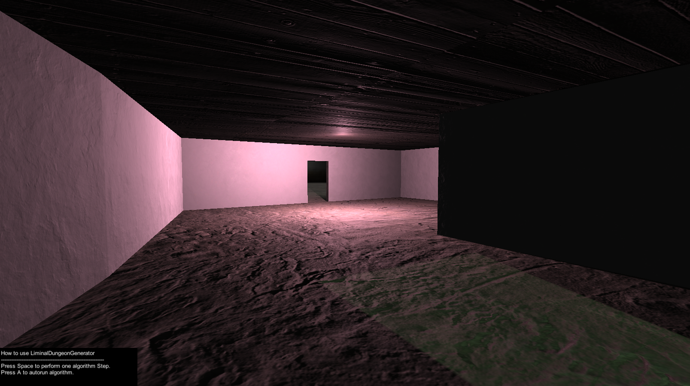

# About
This project contains a Unity library assisting in procedural mesh generation. It's aim is to automate processes that have to be repeated often when dealing with (procedural) mesh generation in unity.

# Main Features
* Usable both in-editor and at runtime (examples for both included)
* Easy instancing, changing and applying meshes to GameObjects
* Meshes are created 100% in code, no prefabs needed
* Functions to easily add basic and more complex geometric shapes to a mesh (planes, cylinders, spheres, rooms, paths and more) with full UV support
* Implementation in URP with working detailed example materials
* Full submesh support, allowing for different materials in 1 mesh

# How to Use
All the needed files are in **Assets/Scripts/MeshBuilderLib**. To use the library simply copy that folder into your project and import it by "using MeshBuilderLib".
To use the functionalities create a new MeshBuilder object. You can then manipulate the mesh by using the several functions of the meshbuilder. When you're done, use the ApplyMesh function to update the mesh in the scene.

The repo also includes some example projects that use the library and a MeterialHandler with some basic ready-to-use materials. To correctly use the example projects and materials also copy **Assets\Resources\Materials** into your project.

# Editor example projects
You'll find multiple generators that create meshes in-editor using the library. They can be found within the default scene in "EditorGenerators". Simply press the "Generate" button on their GameObjects to try them out. Additional ones can be set up the same way.

# Runtime example project - Liminial Dungeon Generator
The repo also includes a bigger test project that uses the library - the LiminalDungeonGenerator. This generator showcases how the library can also be used for runtime mesh generation.
It can generate a whole simple dungeon, consisting of simple rooms and corridors using the MeshBuilder library and a basic dungeon generator algorithm to create and connect modules/rooms.

Here's a screenshot of how that looks.

  